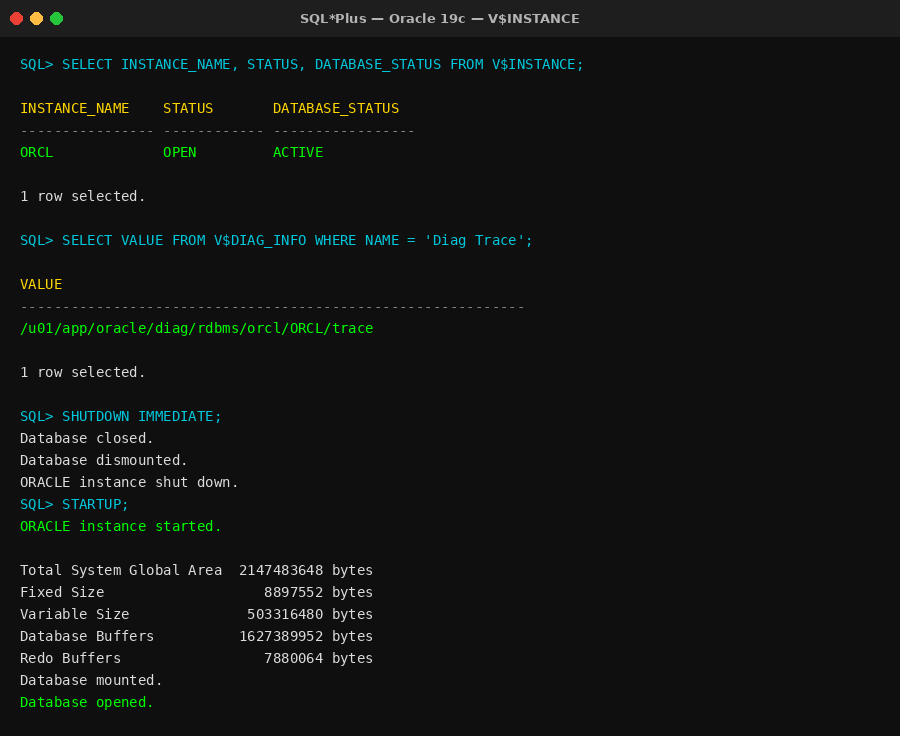
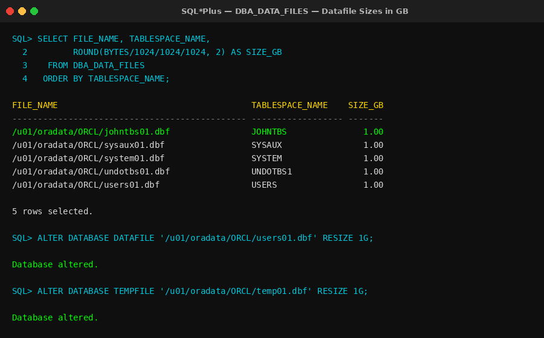
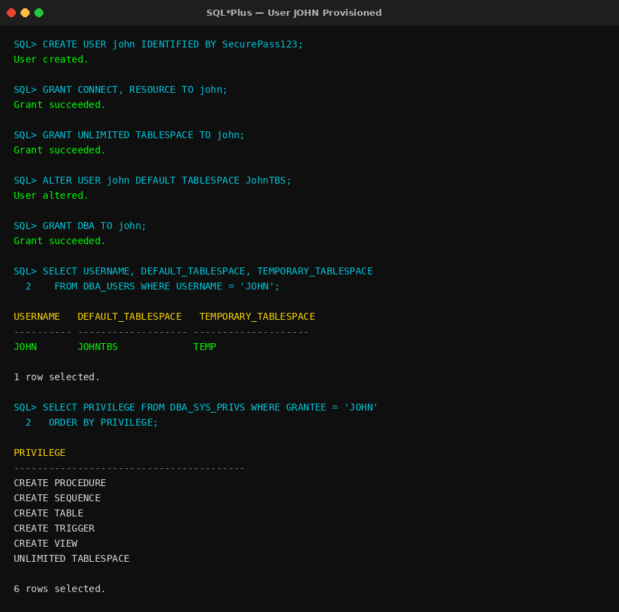
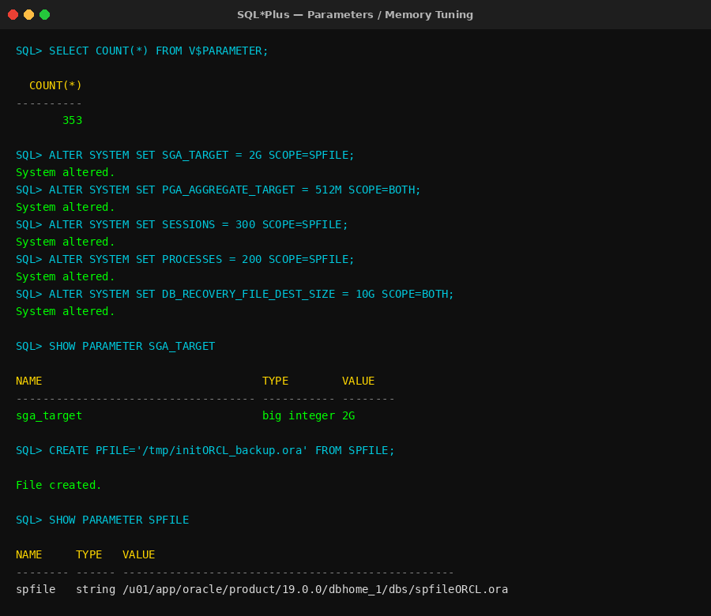
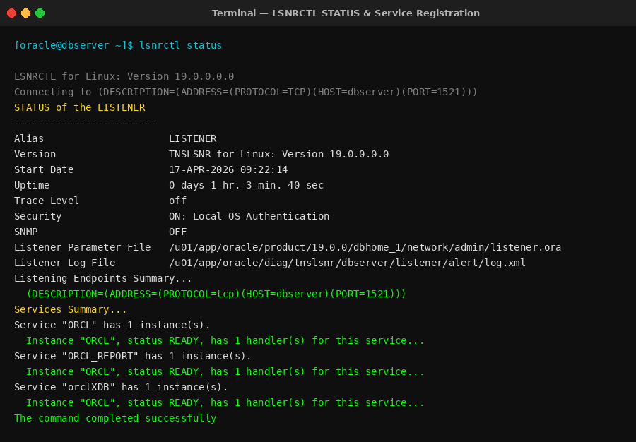
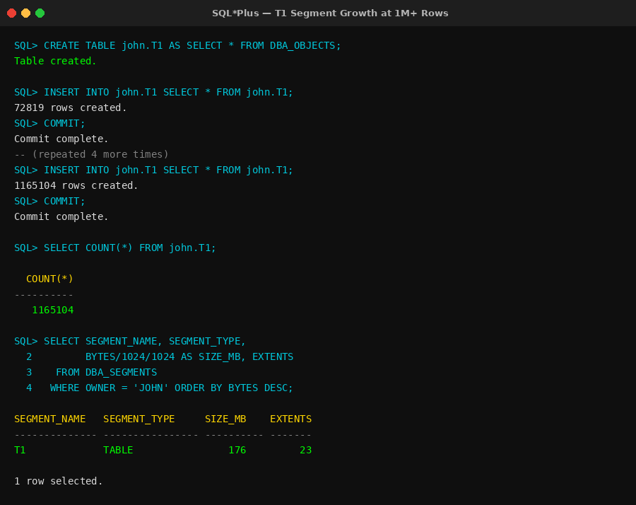
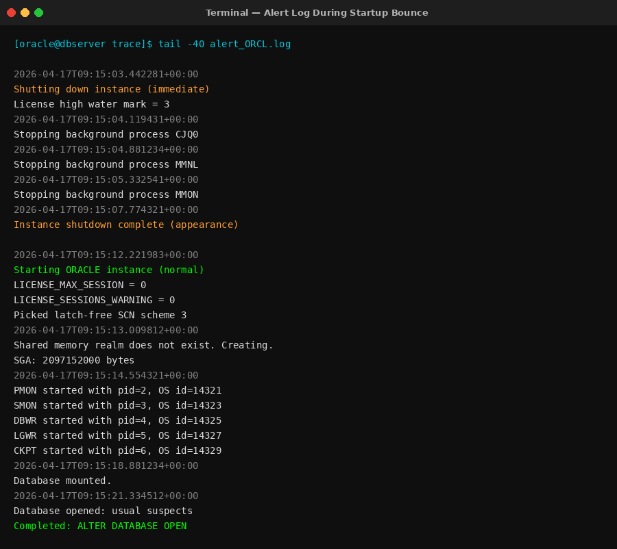
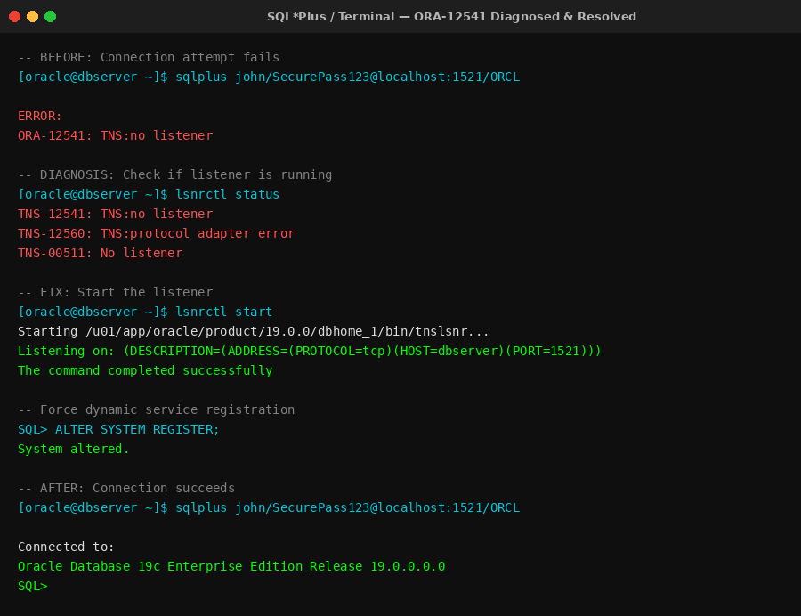

# 🗄️ Oracle Database Administrator — Hands-On Lab


> A comprehensive, hands-on Oracle 19c Database Administration lab project simulating real DBA workflows — covering instance architecture, startup/shutdown operations, tablespace & storage management, user provisioning, memory/SGA tuning, listener networking, segment growth analysis, and alert log monitoring.

---

## 👤 Author

**Muhammad Wahab Asghar**  
Aspiring Oracle DBA | Oracle 19c | SQL | Administration | Troubleshooting  
🔗 [LinkedIn — www.linkedin.com/in/mwahabasghar](https://www.linkedin.com/in/mwahabasghar)  
💻 [GitHub — github.com/masgha4](https://github.com/masgha4)

---

## 📋 Table of Contents

- [Project Overview](#-project-overview)
- [Lab Modules](#-lab-modules)
- [Key Oracle Views & Tools Used](#-key-oracle-views--tools-used)
- [Known Errors & How I Fixed Them](#-known-errors--how-i-fixed-them)
- [Accomplishments](#-accomplishments)
- [How to Run This Lab](#-how-to-run-this-lab)
- [Results & Screenshots](#-results--screenshots)
- [Skills Demonstrated](#-skills-demonstrated)

---

## 📌 Project Overview

This project documents real, hands-on Oracle DBA lab work completed in an **Oracle 19c** environment running on Linux. Each module tackles a specific DBA responsibility that mirrors production DBA duties — from provisioning users and resizing datafiles, to tuning SGA/PGA memory, configuring listener services, and analyzing segment/extent growth at scale (1M+ rows).

The labs were executed using **SQL\*Plus** and Oracle dynamic performance views (`V$`, `DBA_*`) in a self-hosted Oracle environment — not a pre-configured sandbox.

---

## 🧪 Lab Modules

### 📁 Lab 1 — `alertlog-startup-bounce`
**Alert Log Monitoring & Database Bounce**

Practiced monitoring the Oracle alert log during a shutdown/startup cycle to understand what the database logs at each stage.

**Tasks performed:**
- Located the alert log path using `V$DIAG_INFO`
- Performed a clean `SHUTDOWN IMMEDIATE` followed by `STARTUP`
- Observed and documented alert log entries for each phase
- Verified instance status post-startup with `V$INSTANCE`

```sql
-- Find alert log location
SELECT VALUE FROM V$DIAG_INFO WHERE NAME = 'Diag Trace';

-- Bounce the database
SHUTDOWN IMMEDIATE;
STARTUP;

-- Verify instance is open
SELECT INSTANCE_NAME, STATUS, DATABASE_STATUS FROM V$INSTANCE;
```

---

### 📁 Lab 2 — `linux-server-basics`
**Linux Server Health Checks for Oracle DBAs**

Demonstrated Linux proficiency required for day-to-day Oracle DBA work on Linux servers.

**Tasks performed:**
- Checked CPU, memory, and disk usage relevant to Oracle performance
- Used `top`, `free -h`, `df -h`, and `iostat` to assess server health
- Navigated Oracle diagnostic directories (`$ORACLE_BASE/diag`)
- Verified Oracle process status using `ps -ef | grep pmon`

```bash
# Check Oracle processes are running
ps -ef | grep pmon

# Check available disk space for Oracle datafiles
df -h /u01

# Check memory available for SGA
free -h

# Monitor I/O activity on Oracle datafile disks
iostat -xz 1 5
```

---

### 📁 Lab 3 — `listener-services-networking`
**Listener & Service Configuration**

Diagnosed and configured Oracle listener and database services to ensure proper client connectivity.

**Tasks performed:**
- Checked listener status with `LSNRCTL STATUS`
- Verified existing `SERVICE_NAMES` parameter
- Added a new service to `SERVICE_NAMES` without removing existing ones
- Restarted listener and used `ALTER SYSTEM REGISTER` to force service registration
- Confirmed registration via `LSNRCTL SERVICES`

```sql
-- Check current service names
SHOW PARAMETER SERVICE_NAMES;

-- Add a new service without dropping existing ones
ALTER SYSTEM SET SERVICE_NAMES = 'ORCL, ORCL_REPORT' SCOPE=BOTH;

-- Force dynamic registration to listener
ALTER SYSTEM REGISTER;
```

```bash
lsnrctl stop
lsnrctl start
lsnrctl services
```

---

### 📁 Lab 4 — `parameters-memory-fra`
**Instance Parameters, Memory Tuning & FRA Sizing**

Reviewed and updated critical Oracle instance parameters to optimize memory allocation and Flash Recovery Area sizing.

**Tasks performed:**
- Counted total instance parameters using `V$PARAMETER`
- Updated `SGA_TARGET`, `SGA_MAX_SIZE`, `PGA_AGGREGATE_TARGET`
- Tuned session/process limits: `SESSIONS`, `PROCESSES`
- Sized `SORT_AREA_SIZE`, `SHARED_POOL_RESERVED_SIZE`, `JAVA_POOL_SIZE`
- Configured `DB_RECOVERY_FILE_DEST_SIZE` (FRA)
- Created a PFILE from the live SPFILE for backup/documentation

```sql
-- Count all parameters
SELECT COUNT(*) FROM V$PARAMETER;

-- Update SGA memory targets
ALTER SYSTEM SET SGA_TARGET = 2G SCOPE=SPFILE;
ALTER SYSTEM SET SGA_MAX_SIZE = 2G SCOPE=SPFILE;
ALTER SYSTEM SET PGA_AGGREGATE_TARGET = 512M SCOPE=BOTH;

-- Update session/process limits (requires restart)
ALTER SYSTEM SET SESSIONS = 300 SCOPE=SPFILE;
ALTER SYSTEM SET PROCESSES = 200 SCOPE=SPFILE;

-- Set FRA size
ALTER SYSTEM SET DB_RECOVERY_FILE_DEST_SIZE = 10G SCOPE=BOTH;

-- Create PFILE from running SPFILE
CREATE PFILE='/tmp/initORCL_backup.ora' FROM SPFILE;

-- Find SPFILE location
SHOW PARAMETER SPFILE;
```

---

### 📁 Lab 5 — `segments-extents-data-growth`
**Segment & Extent Growth Analysis (1M+ Rows)**

Simulated real-world table growth to observe how Oracle manages segments, extents, and storage allocation dynamically.

**Tasks performed:**
- Created table `T1` in the `JOHN` schema seeded from `DBA_OBJECTS`
- Used repeated `INSERT INTO ... SELECT` to grow the table to 1M+ rows
- Committed in batches to simulate real transaction patterns
- Verified segment and extent growth using `DBA_SEGMENTS`

```sql
-- Create initial table from DBA_OBJECTS
CREATE TABLE john.T1 AS SELECT * FROM DBA_OBJECTS;

-- Grow table to 1M+ rows (repeat as needed)
INSERT INTO john.T1 SELECT * FROM john.T1;
COMMIT;

-- Verify row count
SELECT COUNT(*) FROM john.T1;

-- Check segment info
SELECT SEGMENT_NAME, SEGMENT_TYPE,
       BYTES/1024/1024 AS SIZE_MB, EXTENTS
FROM DBA_SEGMENTS
WHERE OWNER = 'JOHN'
ORDER BY BYTES DESC;
```

---

### 📁 Lab 6 — `startup-modes-instance-architecture`
**Startup Modes & Oracle Instance Architecture**

Practiced all Oracle startup stages manually to build deep understanding of the instance lifecycle.

**Tasks performed:**
- Started database through `NOMOUNT` → `MOUNT` → `OPEN` manually
- Verified instance status at each stage using `V$INSTANCE`
- Documented what is available to the DBA at each stage
- Verified default listener port using `V$PARAMETER`

```sql
-- Stage 1: NOMOUNT — starts instance, reads SPFILE/PFILE
STARTUP NOMOUNT;
SELECT STATUS FROM V$INSTANCE;  -- Expected: STARTED

-- Stage 2: MOUNT — reads control file
ALTER DATABASE MOUNT;
SELECT STATUS FROM V$INSTANCE;  -- Expected: MOUNTED

-- Stage 3: OPEN — opens datafiles, applies redo
ALTER DATABASE OPEN;
SELECT STATUS FROM V$INSTANCE;  -- Expected: OPEN

-- Verify listener port
SHOW PARAMETER LOCAL_LISTENER;
```

---

### 📁 Lab 7 — `storage-tablespaces-datafiles-temp`
**Tablespace, Datafile & TEMP Management**

Performed full tablespace and storage administration — a core DBA responsibility in any production environment.

**Tasks performed:**
- Listed all tablespaces using `V$TABLESPACE` and `DBA_TABLESPACES`
- Queried datafile sizes in MB and GB using `DBA_DATA_FILES`
- Resized datafiles to the nearest 1GB
- Increased TEMP tablespace tempfile to 1GB
- Created new tablespace `JohnTBS` with a 1GB datafile
- Verified free space using `DBA_FREE_SPACE`

```sql
-- List datafiles with size in GB
SELECT FILE_NAME, TABLESPACE_NAME,
       ROUND(BYTES/1024/1024/1024, 2) AS SIZE_GB
FROM DBA_DATA_FILES
ORDER BY TABLESPACE_NAME;

-- Resize a datafile to 1GB
ALTER DATABASE DATAFILE '/u01/oradata/ORCL/users01.dbf' RESIZE 1G;

-- Resize TEMP tempfile to 1GB
ALTER DATABASE TEMPFILE '/u01/oradata/ORCL/temp01.dbf' RESIZE 1G;

-- Create new tablespace for John
CREATE TABLESPACE JohnTBS
  DATAFILE '/u01/oradata/ORCL/johntbs01.dbf'
  SIZE 1G AUTOEXTEND OFF;

-- Check free space per tablespace
SELECT TABLESPACE_NAME,
       ROUND(SUM(BYTES)/1024/1024, 2) AS FREE_MB
FROM DBA_FREE_SPACE
GROUP BY TABLESPACE_NAME
ORDER BY FREE_MB;
```

---

### 📁 Lab 8 — `user-security-accounts`
**User Provisioning & Privilege Administration**

Executed a complete DBA user provisioning workflow — from account creation to privilege granting and tablespace assignment.

**Tasks performed:**
- Created user `JOHN` with a secure password
- Granted `CONNECT`, `RESOURCE`, and `UNLIMITED TABLESPACE`
- Granted object creation privileges
- Verified default and temporary tablespaces using `DBA_USERS`
- Changed John's default tablespace to `JohnTBS`
- Granted the `DBA` role and confirmed all privileges via `DBA_SYS_PRIVS`

```sql
-- Create the user
CREATE USER john IDENTIFIED BY SecurePass123;

-- Grant basic roles
GRANT CONNECT, RESOURCE TO john;
GRANT UNLIMITED TABLESPACE TO john;

-- Grant object creation privileges
GRANT CREATE TABLE, CREATE VIEW, CREATE PROCEDURE,
      CREATE SEQUENCE, CREATE TRIGGER TO john;

-- Verify user's tablespace settings
SELECT USERNAME, DEFAULT_TABLESPACE, TEMPORARY_TABLESPACE
FROM DBA_USERS
WHERE USERNAME = 'JOHN';

-- Move John's default tablespace
ALTER USER john DEFAULT TABLESPACE JohnTBS;

-- Grant DBA role
GRANT DBA TO john;

-- Confirm all system privileges granted
SELECT GRANTEE, PRIVILEGE, ADMIN_OPTION
FROM DBA_SYS_PRIVS
WHERE GRANTEE = 'JOHN'
ORDER BY PRIVILEGE;
```

---

## 🔍 Key Oracle Views & Tools Used

| View / Tool | Purpose |
|---|---|
| `V$INSTANCE` | Instance name, status, startup mode |
| `V$DIAG_INFO` | Alert log and diagnostic file paths |
| `V$TABLESPACE` | List of all tablespaces in the database |
| `V$PARAMETER` | Current instance parameter values |
| `DBA_DATA_FILES` | Datafile names, tablespace, size |
| `DBA_TEMP_FILES` | Temp tablespace tempfile details |
| `DBA_USERS` | User accounts, tablespace assignments |
| `DBA_SEGMENTS` | Segment storage & extent allocation |
| `DBA_FREE_SPACE` | Free space per tablespace |
| `DBA_SYS_PRIVS` | System privileges granted to users |
| `SQL*Plus` | Primary CLI for all SQL/DDL execution |
| `LSNRCTL` | Listener start/stop/status/services |

---

## ⚠️ Known Errors & How I Fixed Them

### Error 1 — `ORA-01031: insufficient privileges`
**Situation:** Queried `DBA_DATA_FILES` as a non-DBA user.  
**Root Cause:** User lacked `SELECT ANY DICTIONARY` privilege or the `DBA` role.  
**Fix:**
```sql
GRANT SELECT ANY DICTIONARY TO john;
-- Or grant full DBA role
GRANT DBA TO john;
```

---

### Error 2 — `ORA-01109: database not open`
**Situation:** Queried `DBA_USERS` while the database was still in MOUNT mode.  
**Root Cause:** Data dictionary views are only accessible after `ALTER DATABASE OPEN`.  
**Fix:**
```sql
ALTER DATABASE OPEN;
SELECT USERNAME FROM DBA_USERS;
```

---

### Error 3 — `ORA-12541: TNS:no listener`
**Situation:** Could not connect remotely via SQL Developer — connection refused.  
**Root Cause:** Oracle listener was not running after a server restart.  
**Fix:**
```bash
lsnrctl start
lsnrctl status
```
```sql
-- Force service re-registration
ALTER SYSTEM REGISTER;
```

---

### Error 4 — `ORA-01034: ORACLE not available` / `ORA-27101`
**Situation:** Could not connect to the database via SQL\*Plus at all.  
**Root Cause:** Oracle instance was not running — required a full startup.  
**Fix:**
```bash
export ORACLE_SID=ORCL
sqlplus / as sysdba
```
```sql
STARTUP;
```

---

### Error 5 — Service not appearing after `ALTER SYSTEM SET SERVICE_NAMES`
**Situation:** Added a new service name but `LSNRCTL SERVICES` didn't show it.  
**Root Cause:** Dynamic registration has up to a 60-second delay by default.  
**Fix:**
```sql
ALTER SYSTEM REGISTER;
```
```bash
lsnrctl services
```

---

### Error 6 — `ORA-01652: unable to extend temp segment`
**Situation:** Large sort/join operation failed during the 1M+ row lab.  
**Root Cause:** TEMP tablespace tempfile was too small for the sort workload.  
**Fix:**
```sql
ALTER DATABASE TEMPFILE '/u01/oradata/ORCL/temp01.dbf' RESIZE 1G;
-- Or add a second tempfile
ALTER TABLESPACE TEMP ADD TEMPFILE '/u01/oradata/ORCL/temp02.dbf' SIZE 1G;
```

---

## 🏆 Accomplishments

| # | Accomplishment |
|---|---|
| ✅ 1 | Stood up a full Oracle 19c environment on Linux and completed all 8 labs independently |
| ✅ 2 | Executed complete database startup/shutdown cycles and monitored alert log behavior at each stage |
| ✅ 3 | Administered tablespaces and datafiles — resizing, creating, and monitoring free space |
| ✅ 4 | Provisioned users with precise privilege grants and tablespace assignments per DBA best practices |
| ✅ 5 | Tuned instance memory parameters (SGA, PGA, FRA, session/process limits) using `ALTER SYSTEM` |
| ✅ 6 | Configured and troubleshot Oracle listener and dynamic service registration end-to-end |
| ✅ 7 | Grew a table to 1M+ rows and analyzed segment/extent behavior using `DBA_SEGMENTS` |
| ✅ 8 | Diagnosed and resolved 6 distinct ORA- errors with documented root causes and fixes |
| ✅ 9 | Applied Linux server health checks (CPU, memory, disk, I/O) as part of the DBA monitoring workflow |
| ✅ 10 | Created a PFILE from a live SPFILE for instance parameter documentation and disaster recovery prep |

---

## ▶️ How to Run This Lab

### Prerequisites

| Requirement | Details |
|---|---|
| OS | Oracle Linux 7/8, RHEL 7/8, or Windows with Oracle installed |
| Oracle Version | Oracle Database 19c (Express Edition is free) |
| Tools | SQL\*Plus (included with Oracle), optionally SQL Developer |
| Privilege | Access to a user with `SYSDBA` privilege for admin tasks |

---

### Step 1 — Install Oracle 19c

Download Oracle Database 19c from Oracle's official site:  
🔗 https://www.oracle.com/database/technologies/oracle19c-linux-downloads.html

---

### Step 2 — Set Environment Variables (Linux)

```bash
export ORACLE_SID=ORCL
export ORACLE_HOME=/u01/app/oracle/product/19.0.0/dbhome_1
export PATH=$ORACLE_HOME/bin:$PATH
```

Add to `~/.bash_profile` to persist across sessions.

---

### Step 3 — Connect as SYSDBA

```bash
sqlplus / as sysdba
```

Verify:
```sql
SELECT INSTANCE_NAME, STATUS FROM V$INSTANCE;
```

---

### Step 4 — Clone This Repository

```bash
git clone https://github.com/masgha4/Oracle-Database-Administrator-Hands-on-Lab.git
cd Oracle-Database-Administrator-Hands-on-Lab
```

---

### Step 5 — Run Each Lab Module

Navigate to any lab folder and run the SQL file, or paste individual blocks into SQL\*Plus interactively:

```bash
# Example
sqlplus / as sysdba @user-security-accounts/lab.sql
```

Each lab's verification queries at the end will confirm successful execution.

---

## 📸 Results & Screenshots

> Screenshots were captured directly from SQL\*Plus during live lab execution.  
> To add your own: run each lab, screenshot the SQL\*Plus terminal output, and save images to a `/screenshots` folder in the repo.

---

### Screenshot 1 — Database OPEN Confirmed (`V$INSTANCE`)
_Shows the instance is fully open after completing the startup-modes lab_



---

### Screenshot 2 — Datafile Sizes in GB (`DBA_DATA_FILES`)
_Lists all datafiles with sizes after resizing_



---

### Screenshot 3 — User JOHN Provisioned (`DBA_USERS` + `DBA_SYS_PRIVS`)
_Confirms user creation, default tablespace set to JohnTBS, and DBA role granted_



---

### Screenshot 4 — Parameters Updated (`V$PARAMETER`)
_Shows updated SGA_TARGET, PGA_AGGREGATE_TARGET, and SESSIONS values_



---

### Screenshot 5 — Listener Running & Services Registered
_LSNRCTL STATUS output confirming listener is active and services are registered_



---

### Screenshot 6 — T1 Segment at 1M+ Rows (`DBA_SEGMENTS`)
_Table T1 segment size after growing to over one million rows_



---

### Screenshot 7 — Alert Log During Startup Bounce
_Alert log output showing shutdown and startup sequence_



---

### Screenshot 8 — ORA-12541 Resolved (Before & After LSNRCTL)
_Side-by-side showing the error and successful resolution after starting the listener_



---

> 📂 Store all screenshots in a `/screenshots` folder at the root of the repository using the filenames above.

---

## 💼 Skills Demonstrated

- **Oracle 19c Administration** — startup/shutdown, alert log, startup modes
- **Storage Management** — tablespaces, datafiles, tempfiles, free space
- **User & Privilege Administration** — user creation, roles, quotas, `DBA_SYS_PRIVS`
- **Memory Tuning** — SGA, PGA, FRA, shared pool, sort area, session/process limits
- **Networking** — listener config, service registration, `LSNRCTL`
- **Segment/Extent Analysis** — real growth simulation at 1M+ rows
- **Error Diagnosis** — 6 real ORA- errors with root cause analysis and documented fixes
- **Linux for DBAs** — server health checks, Oracle process monitoring, environment setup
- **SQL\*Plus Proficiency** — all labs executed via command-line interface

---

## 📄 License

This project is licensed under the MIT License. See the [LICENSE](LICENSE) file for details.
